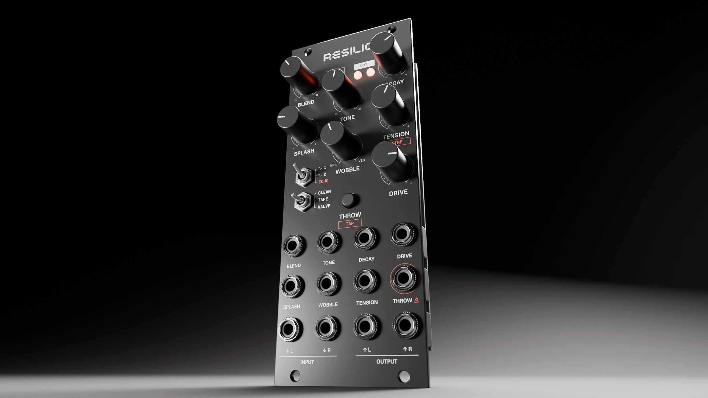

# Resilio Versio

**A dub-inspired spring reverb and tape echo for the Noise Engineering Versio.** Throw snares into it, splash it, drive it, filter it like King Tubby, hold it forever, push it into a howl, or feed it from a worn tape echo. Free firmware for the Versio Eurorack module, and the same sound as an AU/VST3 plugin for macOS.

### → [resilio-versio.vercel.app](https://resilio-versio.vercel.app): listen, download, and read the manual

[Download](https://resilio-versio.vercel.app/#download) · [Install](https://resilio-versio.vercel.app/install/) · [Manual](https://resilio-versio.vercel.app/manual/) · [Starting points](https://resilio-versio.vercel.app/presets/) · [Changelog](https://resilio-versio.vercel.app/changelog/) · [FAQ](https://resilio-versio.vercel.app/faq/)

*Resilio*: Latin, "I leap back, rebound". By [Jesse Bauer](https://jessebauer.xyz). Not affiliated with or endorsed by Noise Engineering.

## What it is

Resilio is alternative firmware for the [Versio](https://noiseengineering.us/products/versio), Noise Engineering's open Eurorack platform. It replaces the module's firmware entirely and goes back just as easily, using Noise Engineering's own Firmware Swap web app.

It's a spring tank, not a room. Every hit lands in the springs as its own splash: a bright clang, echoes that sweep upward (the spring's "boing"), then a tail that darkens into a wash. It's built around the moves of dub, where the mixing desk is played live:

- **The throw.** Open the springs for one snare and let the tail ring on, from the button or the gate input.
- **King Tubby's “Big Knob”.** TONE's right half is a steep low cut modelled on the Altec filter on Tubby's desk.
- **Tape echo into springs.** TANK ECHO puts a worn tape echo in front of the springs, clocked or tapped.
- **The held bed and the howl.** DECAY's top holds the tail as a bed that ducks under your kick and bass (dub techno's sidechained reverb), or, in VALVE, lets the tank howl.
- **Colour you choose.** ATTITUDE picks CLEAN, TAPE (tape saturation and 12-bit µ-law grain) or VALVE (a cranked valve stage and 10-bit grit). Your dry signal is never touched.

Seven knobs, each with a CV input, two switches, a button and a gate. The [manual](https://resilio-versio.vercel.app/manual/) covers every control, and [Starting points](https://resilio-versio.vercel.app/presets/) has settings for classic dub and dub techno sounds.

> **Status:** the first public release: working firmware, played on real hardware. The sound may still change between versions.

## Get it

Download from the [website](https://resilio-versio.vercel.app/#download) or this repository's [Releases](https://github.com/jeffebauer/resilio-versio/releases/latest):

- **Firmware for Versio** ([`resilio-versio-firmware.bin`](https://github.com/jeffebauer/resilio-versio/releases/latest/download/resilio-versio-firmware.bin)): install it in Chrome with Noise Engineering's [Firmware Swap](https://noiseengineering.us/portal/firmware). Power the module from USB only: **never connect USB and Eurorack power at the same time.**
- **Plugin for macOS** ([`resilio-versio-plugin-macos.zip`](https://github.com/jeffebauer/resilio-versio/releases/latest/download/resilio-versio-plugin-macos.zip)): AU and VST3, macOS 12 or newer, Apple Silicon or Intel. The same panel and sound. It follows your DAW's tempo, and MIDI notes act as the gate.

Step-by-step instructions, including how to go back to Noise Engineering's firmware, are on the [install page](https://resilio-versio.vercel.app/install/).

## How it was made

Resilio was designed by ear. Jesse Bauer, a designer and dub enthusiast, brought the musical goals and made every sonic decision. Claude (Anthropic's AI) was the engineering partner, writing the DSP, the firmware and the tools. The springs follow Välimäki, Parker and Abel's physical model, tuned round after round against recordings of a real spring tank. Every candidate sound was heard against the last in level-matched listening tests before it shipped. Over forty decisions are recorded with their reasons in [`docs/adr/`](docs/adr/).

## For builders

One DSP core with no platform code and three hosts: an offline renderer (WAV in, WAV out), the JUCE plugin and the Versio firmware (libDaisy). Every host reads the same parameter table, so a setting in the plugin sounds the same on the module. The firmware fits in 128 KB of flash and stays under 80 % of the chip at its busiest moment.

- Building and flashing your own: [`docs/building.md`](docs/building.md)
- The specification: [`SPEC.md`](SPEC.md). Vocabulary: [`CONTEXT.md`](CONTEXT.md). Decisions: [`docs/adr/`](docs/adr/)
- Firmware variants, CPU runs and flash budget: [`firmware/README.md`](firmware/README.md)

## Feedback

Resilio is refined with the people playing it, and feedback is very welcome. [Suggest a sound](https://github.com/jeffebauer/resilio-versio/issues/new?template=sound_idea.yml) or [report a bug](https://github.com/jeffebauer/resilio-versio/issues/new?template=bug_report.yml): each is a short form. Ideas are tried and listened to before anything ships, and the ones that make it are credited in the [changelog](https://resilio-versio.vercel.app/changelog/). More in the [FAQ](https://resilio-versio.vercel.app/faq/#how-do-i-give-feedback-or-report-a-bug).

## Licence

- **Code, tools and docs:** MIT, see [`LICENSE`](LICENSE).
- **Plugin binaries:** AGPLv3. The plugin is built on [JUCE](https://juce.com), used under its AGPLv3 licence (full text in [`LICENSES/AGPL-3.0.txt`](LICENSES/AGPL-3.0.txt)). Each release's source is this repository at that release's tag.
- **Firmware:** our MIT code with libDaisy (MIT), the STM32 HAL (BSD-3-Clause) and CMSIS (Apache-2.0). No JUCE, and no Noise Engineering code.
- Third-party notices: [`NOTICE`](NOTICE).

## Acknowledgements

- Spring reverb modelling: V. Välimäki, J. Parker and J. S. Abel; J. Parker; S. Bilbao (full references in [`SPEC.md` §11](SPEC.md)).
- [Electro-Smith](https://electro-smith.com) for libDaisy, and [Noise Engineering](https://noiseengineering.us) for the open Versio platform.
- The engineers whose moves this is built around: King Tubby, Lee "Scratch" Perry, Scientist, Dennis Bovell, Adrian Sherwood, and the dub techno lineage after them.

## Trademarks

Versio is a trademark of Noise Engineering. VST is a registered trademark of Steinberg Media Technologies GmbH. Audio Units is a trademark of Apple Inc.
